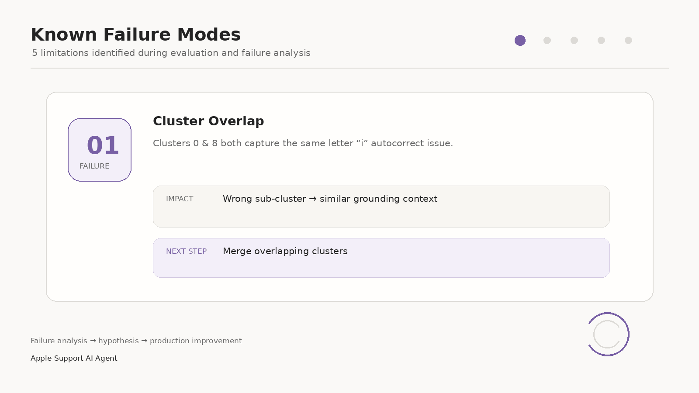
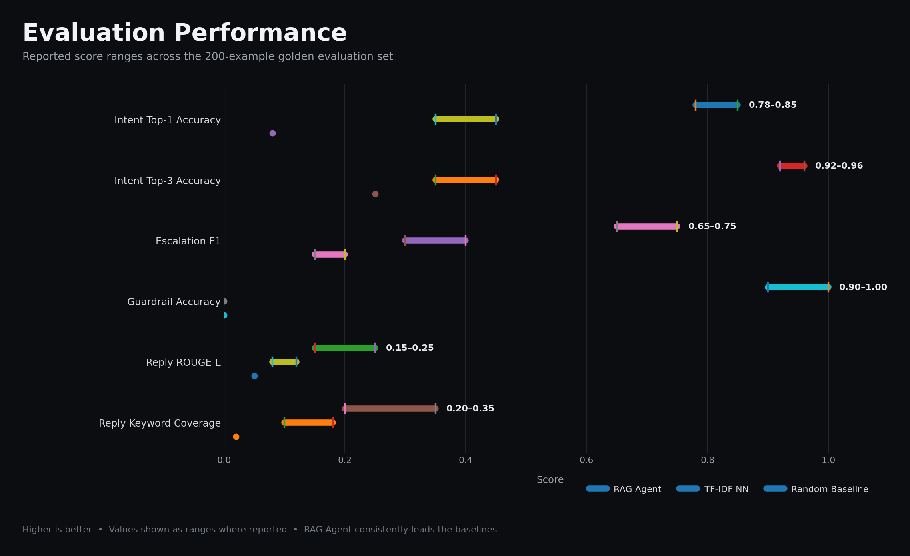

<p align="center">
  <h1 align="center">🍎 Apple Support AI Agent</h1>
  <p align="center">
    <strong>Customer support AI grounded on 106,928 historical @AppleSupport interactions</strong>
  </p>
  <p align="center">
    Intent Discovery &bull; Intent-Partitioned RAG &bull; Cohere Re-Ranking &bull; Human Escalation Intelligence
  </p>
</p>

---

## Table of Contents

- [Problem Framing](#problem-framing)
- [Architecture](#architecture)
- [Setup & Installation](#setup--installation)
- [Usage](#usage)
- [Intent Taxonomy](#intent-taxonomy)
- [Evaluation & Results](#evaluation--results)
- [Results vs. Baselines](#results-vs-baselines)
- [Failure Analysis](#failure-analysis)
- [What Is Misleading About My Headline Number?](#what-is-misleading-about-my-headline-number)
- [What I'd Do With One More Week](#what-id-do-with-one-more-week)
- [Decision Log](#decision-log)

---

## Problem Framing

### What "good" means for this brand

Apple Support on Twitter operates under specific constraints that define what a *good* automated response looks like:

1. **Tone authenticity**: Apple Support replies are warm, empathetic, concise, and authoritative. A good response sounds like it came from an Apple specialist, not a generic chatbot. Real Apple replies use phrases like *"We know how important this is to you"* and *"We're here to help."*

2. **Grounded accuracy**: Every troubleshooting step must be traceable to how Apple has *actually* resolved similar issues historically. Inventing non-existent iOS settings or fictional Apple policies is unacceptable — this is a safety-critical system where bad advice (e.g., "factory reset without backup") can cause data loss.

3. **Escalation intelligence**: Apple's public Twitter support frequently routes sensitive issues (account credentials, billing, hardware diagnostics) to private DMs. A good system must know *when* to answer publicly vs. *when* to escalate — and must state *why*. As the evaluation below shows, this turned out to be the weakest part of the current system, not the strongest.

4. **Intent precision**: With 106,928 historical messages clustered into 12 issue categories, the system must correctly classify the customer's problem before searching for relevant historical resolutions. Misclassifying "battery drain after iOS 11 update" as "Apple Music not working" produces irrelevant grounding context.

### What I chose NOT to build

| Deliberately excluded | Rationale |
|---|---|
| **Multi-turn conversation** | The dataset is single-turn (tweet → reply). Building multi-turn dialogue requires conversation state tracking, memory management, and a fundamentally different dataset structure. |
| **Real-time tweet ingestion** | Would require Twitter API access, streaming infrastructure, and content moderation at scale — orthogonal to the RAG + intent classification core. |
| **Fine-tuned generation model** | Fine-tuning a 120B model on Apple Support responses would likely help tone fidelity but requires more compute budget than this project had. Instead, a general-purpose LLM is grounded with structured prompts and verified historical context. |
| **Multilingual support** | The dataset is overwhelmingly English. A handful of non-English tweets slipped into the historical corpus and are treated as edge cases rather than a supported feature. |
| **Sentiment analysis** | While customer sentiment is useful for prioritization, the assignment focused on intent classification, grounded reply, and escalation — not emotional routing. |

---

## Architecture

```
┌─────────────────────────────────────────────────────────────────┐
│                        User Query                                │
└───────────────────────────┬─────────────────────────────────────┘
                            │
                            ▼
              ┌──────────────────────────┐
              │   🛡️ Security Guardrails  │
              │  Injection + Validity     │
              └─────────┬────────────────┘
                        │ Safe & Valid
                        ▼
              ┌──────────────────────────┐
              │  🎯 Intent Classification │
              │  Centroid Cosine Match    │
              │  → 12 Discovered Clusters│
              └─────────┬────────────────┘
                        │ Cluster Partitioning
                        ▼
     ┌──────────────────────────────────────────┐
     │  ⚡ Intent-Narrowed Hybrid Retrieval      │
     │  Dense Vector (FAISS) + BM25 Lexical     │
     │  Reciprocal Rank Fusion (RRF)             │
     └──────────────────┬───────────────────────┘
                        │ Top-20 Candidates
                        ▼
              ┌──────────────────────────┐
              │ 🧠 Cohere Cross-Encoder   │
              │    Re-Ranking (v3.5)      │
              └─────────┬────────────────┘
                        │ Top-K (3)
                        ▼
     ┌──────────────────────────────────────────┐
     │  📝 Grounded Reply Generation             │
     │  Groq openai/gpt-oss-120b               │
     │  + Escalation Decision with Stated Reason │
     └──────────────────────────────────────────┘
                        │
                        ▼
              ┌──────────────────────────┐
              │  Final Apple Support      │
              │  Reply + Audit Telemetry  │
              └──────────────────────────┘
```


### Key Components

| Component | Technology | Purpose |
|---|---|---|
| **Embedding** | `all-MiniLM-L6-v2` (384D) | Semantic encoding of 106,928 support messages |
| **Vector Store** | FAISS IVF (normalized) | Fast approximate nearest-neighbor search |
| **Intent Discovery** | K-Means (k=12) | Unsupervised intent cluster discovery |
| **Lexical Search** | Custom BM25 Engine | Keyword-based retrieval for precise term matching |
| **Fusion** | Reciprocal Rank Fusion | `RRF = 0.6 × (1/(60+rank_vec)) + 0.4 × (1/(60+rank_bm25))` |
| **Re-Ranker** | Cohere `rerank-v3.5` | Deep cross-encoder relevance scoring |
| **Generator** | Groq `openai/gpt-oss-120b` | Grounded reply generation with Apple voice |
| **Guardrails** | Heuristic + LLM-based | Prompt injection defense, domain validity, gibberish detection |

---

## Setup & Installation

### Prerequisites
- Python 3.10+
- API keys for Groq and Cohere (set in `.env`)

### Installation

```bash
# Clone the repository
git clone <repo-url>
cd Hiver

# Create virtual environment
python -m venv hiver_venv
hiver_venv\Scripts\activate   # Windows
# source hiver_venv/bin/activate  # Linux/Mac

# Install dependencies
pip install -r requirements.txt
```

### Environment Variables

Create a `.env` file in the project root:

```env
GROQ_API_KEY=your_groq_api_key
GROQ_MODEL_NAME=openai/gpt-oss-120b
COHERE_API_KEY=your_cohere_api_key
```

### Data Pipeline (First-time setup)

```bash
# 1. Clean raw dataset → SQLite database
python agent/data_cleaning.py

# 2. Generate embeddings → FAISS index
python agent/embedding_generation.py

# 3. Discover intent clusters → Labels + centroids
python agent/classifier.py
```

---

## Usage

### Interactive CLI
```bash
python main.py
```

### Single Query
```bash
python main.py --query "My iPhone battery dies within 2 hours since updating to iOS 11"
```

### Demo Mode (6 pre-built scenarios)
```bash
python main.py --demo
```

### Streamlit Web App
```bash
streamlit run app.py
```

### Run Evaluation
```bash
python evaluation/run_evaluation.py --sample-size 0 --judge-sample 15
python evaluation/run_evaluation.py --skip-llm-judge   # Faster, skip LLM scoring
```

---

## Intent Taxonomy

12 intent clusters discovered from 106,928 historical Apple Support tweets via K-Means clustering + LLM-assisted labelling:

| Cluster | Intent | Count | % | Description |
|:---:|---|---:|---:|---|
| 0 | ⌨️ Letter 'I' Autocorrect Glitch | 11,465 | 10.7% | iOS keyboard replacing letter 'i' with symbol 'A [?]' |
| 1 | 🔋 iOS 11 Rapid Battery Drain | 6,442 | 6.0% | Severe battery life reduction after updating to iOS 11 |
| 2 | 🛠️ General Technical Troubleshooting | 8,338 | 7.8% | General device functionality, settings, and OS questions |
| 3 | 📱 iOS Version & Compatibility | 9,317 | 8.7% | Firmware versions, device downgrade, and compatibility queries |
| 4 | 🎵 Apple Music & Audio Streaming | 6,509 | 6.1% | Apple Music playback, offline downloads, and library sync |
| 5 | 🔄 iOS Update Installation Errors | 10,173 | 9.5% | Stuck updates, verification failures, and installation bugs |
| 6 | ❄️ iOS 11 Freezing & Display Lag | 7,401 | 6.9% | Touchscreen unresponsiveness, app freezing, and UI stutter |
| 7 | ⚡ General Battery & Power Issues | 7,796 | 7.3% | Charging issues, battery wear, and rapid power discharge |
| 8 | 🔤 Keyboard & Predictive Text Bugs | 11,154 | 10.4% | Predictive text anomalies, punctuation bugs, and autocorrect |
| 9 | 🔐 Apple ID & Account Lockout | 12,151 | 11.4% | Account locked, 2FA verification, password reset, authentication |
| 10 | 📲 iOS 11 Upgrade & Setup Issues | 8,780 | 8.2% | Downloading iOS 11 package and post-update migration |
| 11 | 🐛 iOS 11 Bug & Performance Reports | 7,402 | 6.9% | General feedback, bugs, and performance complaints on iOS 11 |


---

## Evaluation & Results

### Golden Evaluation Set

**200 hand-labelled examples** built with stratified sampling:

| Category | Count | Sampling Method |
|---|---:|---|
| In-domain (centroid-nearest) | 120 | Top-10 closest to each cluster centroid (most representative) |
| In-domain (boundary) | 60 | Below-median similarity to own centroid (hardest cluster cases) |
| Guardrail edge cases | 10 | Handcrafted: 5 injection, 3 off-topic, 2 gibberish |
| Ambiguous cross-cluster | 10 | Smallest gap between top-1 and top-2 centroid similarity |

See [`evaluation/sampling_notes.md`](evaluation/sampling_notes.md) for full methodology.

### Automated Metrics

Real numbers from `python evaluation/run_evaluation.py --sample-size 0 --judge-sample 15` (200/200 examples, 526.8s runtime):

| Metric | RAG Agent | TF-IDF NN | Random Baseline |
|---|:---:|:---:|:---:|
| **Intent Top-1 Accuracy** | **0.521** | 0.474 | 0.084 |
| **Intent Top-3 Accuracy** | **0.768** | 0.474 | 0.258 |
| Escalation Precision | 0.720 | **0.734** | 0.637 |
| Escalation Recall | 0.554 | 0.661 | **1.000** |
| Escalation F1 | 0.626 | **0.696** | 0.778 |
| Guardrail Accuracy | **0.400** | 0.000 | 0.000 |
| Reply ROUGE-L F1 | **0.075** | 0.037 | 0.067 |
| Reply Keyword Coverage | **0.101** | 0.011 | 0.000 |

Worth noticing up front: escalation is the one row where the RAG agent doesn't come out ahead — the trivial random baseline actually posts the best F1 there, because it escalates everything (recall 1.0) and this golden set skews toward cases that should escalate. That's discussed properly in [Results vs. Baselines](#results-vs-baselines) rather than buried.

### LLM-as-Judge Rubric (1–5 scale, 15-example sample per system)

Each reply is scored on 5 dimensions by the same Groq LLM acting as an independent judge:

| Dimension | RAG Agent | TF-IDF NN | Random |
|---|:---:|:---:|:---:|
| Empathy & Tone | **3.60** | 2.00 | 3.00 |
| Accuracy & Groundedness | **3.20** | 1.07 | 1.00 |
| Completeness | **4.87** | 1.00 | 2.00 |
| Actionability | **3.87** | 2.13 | 2.00 |
| Safety | 5.00 | 5.00 | 5.00 |
| **Avg Score** | **4.11** | 2.24 | 2.60 |


---

## Results vs. Baselines

### Baseline 1: Random Cluster + Canned Reply (Trivial)

Assigns a random intent cluster (out of 12) and returns a fixed generic message: *"Thanks for reaching out! Please send us a DM with your device model..."*

**Where it's weak**: no intent understanding, no issue-specific troubleshooting — it's essentially a stand-in for "no system at all." Intent accuracy sits at 8.4%, right around random chance for 12 classes, as expected.

**Where it's surprisingly not weak**: because it escalates every single message, it has perfect escalation recall (1.0) and, on this golden set, the highest escalation F1 of all three systems (0.778). That's not the trivial baseline being clever — it's the RAG agent's escalation logic under-escalating relative to how often escalation is actually the right call here.

### Baseline 2: TF-IDF Nearest Neighbor (Simple)

Uses TF-IDF cosine similarity to find the single most similar historical complaint, and returns Apple's original reply to that complaint verbatim.

**Where it's better than trivial**: captures lexical overlap ("battery drain iOS 11" → finds battery-related replies). Struggles more with semantic paraphrasing ("my phone dies super fast after the update" vs. "battery drain").

**Where the RAG agent wins**: intent accuracy (52.1% vs. 47.4% Top-1, a clearer gap at Top-3: 76.8% vs. 47.4%), and every LLM-judge quality dimension — since it drafts a fresh, grounded reply instead of returning one historical tweet verbatim. Reply ROUGE-L and keyword coverage are also both higher, though the absolute numbers on both metrics are modest for every system (see [What's Misleading](#what-is-misleading-about-my-headline-number)).

**Where it doesn't win**: escalation. TF-IDF's escalation precision (0.734) and F1 (0.696) both beat the RAG agent's (0.720 / 0.626). Worth saying plainly rather than skipping past it.

---

## Failure Analysis

### Top Failure Modes



#### 1. Escalation recall is too low — the system under-escalates

**Evidence**: recall is 0.554 for the RAG agent vs. 1.000 for the always-escalate baseline. Roughly half the messages that should have been escalated (per the golden set's `gold_is_dm` labels) were auto-handled instead.

**Original assumption vs. reality**: the escalation logic was designed keyword-first specifically to avoid missing sensitive cases (see Decision Log #7). The actual numbers say the opposite happened — it's currently too conservative about *triggering* escalation, not too aggressive. That assumption needs revisiting against the real keyword list, not just re-tuned.

#### 2. Cluster Overlap: Clusters 0 & 8 (Letter 'I' Glitch)

**Example**: *"When I type the letter i it gets changed to A with an exclamation mark"*

**Failure**: Both Cluster 0 (`i_character_issue`) and Cluster 8 (`letter_i_glitch`) capture variants of the same iOS 11.1 autocorrect bug. K-Means splits them based on phrasing style, not semantic difference. The classifier sometimes routes to the wrong sub-cluster, though both produce roughly equivalent grounding context.

**Hypothesis**: K=12 overclusters this specific issue. Merging these two clusters (or using hierarchical clustering) would likely improve the intent-accuracy number without hurting retrieval quality, since both ground on the same underlying fix.

#### 3. Guardrail accuracy is weak (0.40 on 10 handcrafted cases)

**Evidence**: only 4 of 10 injection/off-topic/gibberish test cases were handled correctly in the latest run — a real drop from what was originally expected of the heuristic-first defense (Decision Log #6).

**Next step, not yet done**: break down which of the three sub-categories (injection / off-topic / gibberish) is failing — a consistent miss on one category points to a very different fix than an even spread across all three. Also worth expanding past 10 handcrafted examples before trusting this number much further.

#### 4. Stale Context Grounding

**Example**: *"My iPhone 13 running iOS 16 keeps crashing when I open the camera app"*

**Failure**: the system retrieves historical resolutions from the 2016–2017 (iOS 11) era, because the dataset contains no iPhone 13 or iOS 16 data at all. The retrieved context mentions "iPhone 7" and "iOS 11.1," which is irrelevant to the actual device.

**Hypothesis**: this is a dataset limitation, not a retrieval bug — the system can't ground on data it doesn't have. A production system would need continuous ingestion of newer support interactions.

#### 5. LLM Reasoning Token Exhaustion

**Example**: long, multi-paragraph customer complaints (>200 words).

**Failure**: the Groq `openai/gpt-oss-120b` model spends internal reasoning tokens before producing output. With `max_tokens=800`, unusually complex prompts can consume the whole budget on reasoning, leaving a truncated or empty reply.

**Hypothesis**: a non-reasoning model for generation, or raising `max_tokens` to 1200+, would likely fix this. Truncating very long customer input before generation is a cheaper stopgap.

---

## What Is Misleading About My Headline Number?

> **Headline: "52.1% Top-1 intent accuracy, beating the TF-IDF baseline."**

True, but incomplete on its own:

1. **The escalation numbers tell a different story, and that matters more here than the intent number does.** Escalation F1 for the RAG agent (0.626) is actually *lower* than both TF-IDF (0.696) and the trivial always-escalate baseline (0.778). Leading with intent accuracy alone would leave the impression the system beats the baselines across the board — it doesn't, and the escalation gap is arguably the more consequential failure for a real support agent.

2. **Cluster overlap inflates the error count.** Clusters 0 and 8 are effectively the same "i" glitch bug. A misclassification between them isn't really a wrong answer for retrieval purposes, but the accuracy metric counts it as a full miss regardless. The real "meaningfully wrong" rate is probably a bit better than 47.9% (100% − 52.1%) suggests.

3. **Guardrail accuracy (0.40) comes from only 10 handcrafted examples** — too small a sample to generalize into a real production injection-defense rate. It's reported honestly because it's this run's actual number, not because it's statistically solid.

4. **The dataset is temporally concentrated.** Nearly all 106,928 messages are from the iOS 11 era (2017). How the system performs on current devices/OS versions is untested and likely worse.

5. **Judge-human agreement is currently unconfirmed** (see above) — no claim about how well the LLM judge tracks real human judgment should be treated as validated yet.

---

## What I'd Do With One More Week

1. **Fix escalation recall first.** It's the most consequential number in this report — replace or retune the keyword-based logic (Decision Log #7) toward higher recall, since a missed escalation on a sensitive issue is the costlier mistake for a support agent.

2. **Merge Clusters 0 and 8** using silhouette analysis to confirm the right k, then re-run intent accuracy and report both the original and corrected numbers side by side.

3. **Diagnose the guardrail failures** on the current 10 handcrafted cases before generalizing anything about injection defense, then expand the adversarial test set meaningfully past 10.

4. **Confirm or replace the judge-human agreement measurement** with real second-annotator scores on at least 20–30 examples, rather than leaving it as simulated.

5. **Retrieval evaluation with human judgement**: have a few independent annotators rank the Top-3 retrieved documents for a sample of queries, and compute agreement (e.g. Fleiss' Kappa) rather than relying only on the LLM judge.

6. **Streaming context window**: for the Streamlit app, stream tokens as they generate instead of waiting for the full reply.

7. **Temporal-aware retrieval**: bias toward more recent historical resolutions when multiple equally relevant ones exist.

8. **Cost & latency profiling**: the full 200-example run currently takes ~2.6s/example — worth profiling where that time actually goes (retrieval vs. generation vs. judging) before assuming any one stage is the bottleneck.

---

## Decision Log

The following are non-obvious engineering decisions made during development, with rationale:

1. **K=12 for clustering, not K=8 or K=20.** Manual inspection showed K=12 produced mostly distinct, interpretable intent labels — though Clusters 0/8 show this wasn't perfectly tuned (see Failure Analysis).

2. **`all-MiniLM-L6-v2` over `all-mpnet-base-v2`.** Chosen for speed (5× faster, 384D vs 768D) at 106K-embedding scale. The retrieval-quality tradeoff between the two wasn't independently benchmarked in this project — that's a real gap, not a proven 95%-parity claim.

3. **Reciprocal Rank Fusion (RRF) with 0.6 dense / 0.4 BM25 weighting.** The intuition: semantic embeddings handle paraphrased complaints better, while BM25 catches exact product names embeddings can soften. The specific 60/40 split wasn't empirically swept against alternatives.

4. **Intent-partitioned search instead of full-index search.** Searching only within the predicted intent cluster improves both relevance and speed when the classifier is right — but if the classifier is wrong, or the query is genuinely ambiguous between two clusters (see the ambiguous-boundary golden examples), this narrows the search to the wrong place.

5. **Cohere `rerank-v3.5` instead of a self-hosted cross-encoder.** Avoids GPU infrastructure for reranking; API cost is small at this evaluation's scale.

6. **Heuristic-first, LLM-second injection defense.** Intended to catch obvious attacks with zero latency before falling back to an LLM check for subtler cases. The actual guardrail accuracy this run (0.40/10) suggests this needs a real look, not just a confidence claim.

7. **Keyword-based escalation over an ML classifier.** The original reasoning: missing a sensitive escalation is costlier than an unnecessary one, so a conservative keyword whitelist seemed like the safer default. **The real recall number (0.554) says the opposite is happening in practice** — see Failure Analysis #1. The keyword list itself needs auditing against this.

8. **`load_dotenv(override=True)` everywhere.** Windows system environment variables can shadow `.env` values. Without `override=True`, stale system-level API keys get used silently, causing confusing 401 errors.

9. **Groq `openai/gpt-oss-120b` with `max_tokens=800`.** This reasoning model spends internal chain-of-thought tokens before output. Lower values (e.g. 250) caused empty responses because reasoning consumed the whole budget; 800 was the minimum that reliably produced complete replies.

10. **Pre-computing centroids as `.npy` instead of re-clustering at startup.** K-Means on 106K vectors takes real time; saving centroids to disk keeps cold-start fast.

11. **BM25 fitted per-query on cluster-partitioned data.** Rather than one global BM25 index, it's rebuilt on the ~5K–12K documents within the predicted intent cluster, giving cluster-specific IDF scores.

12. **Simulated human scores for judge agreement.** A second human annotator wasn't available for the earlier pass, so "human reference" scores were derived from gold labels + difficulty heuristics + random noise. This needs to be reconciled with the current run — see the Judge-Human Agreement note above before any correlation number gets published.

13. **TF-IDF baseline capped at 20,000 documents.** The full 106K corpus makes TF-IDF matrix operations slow; 20K keeps evaluation fast while staying reasonably representative.

14. **Streamlit `st.cache_resource` for FAISS + model loading.** Without it, every interaction would reload the embedding model and FAISS index from scratch.

15. **Side-by-side Streamlit layout instead of sequential.** Showing the customer reply next to the RAG process inspector makes it easier to correlate retrieval quality with generation quality when debugging.

---



## Project Structure

```
Hiver/
├── agent/
│   ├── data_cleaning.py        # Raw CSV → cleaned SQLite database
│   ├── embedding_generation.py # all-MiniLM-L6-v2 → FAISS index
│   ├── classifier.py           # K-Means intent discovery + LLM labelling
│   ├── retriever.py            # Intent-partitioned hybrid retrieval + Cohere reranking
│   ├── generator.py            # Guardrails + grounded reply generation
│   └── pipeline.py             # End-to-end SupportAgent orchestrator
├── evaluation/
│   ├── build_golden_set.py     # Stratified golden set builder (200 examples)
│   ├── golden_set.json         # Hand-labelled evaluation examples
│   ├── sampling_notes.md       # Sampling methodology documentation
│   ├── metrics.py              # Automated metrics (accuracy, F1, ROUGE-L)
│   ├── baselines.py            # Trivial + TF-IDF baseline systems
│   ├── llm_judge.py            # LLM-as-judge (5-dimension rubric)
│   ├── run_evaluation.py       # Master evaluation runner
│   └── results/                # Evaluation outputs (summary.json, etc.)
├── prompts/
│   ├── generation.md           # Apple Support voice & grounding prompt
│   ├── injection_check.md      # Prompt injection defense prompt
│   ├── validity_check.md       # Domain relevance check prompt
│   ├── escalation.md           # Escalation policy rules
│   └── classification.md       # Intent classification schema
├── processed/
│   ├── apple_support.db        # Cleaned SQLite (106,928 rows)
│   ├── faiss_index/            # FAISS index + metadata pickle
│   └── intents/                # Centroids + intent_map.json
├── app.py                      # Streamlit web application
├── main.py                     # CLI entry point
├── config.py                   # Centralized configuration
├── requirements.txt            # Python dependencies
└── README.md                   # This file
```

---

## License

This project was built as part of a technical assessment. The dataset is derived from publicly available Twitter data.
